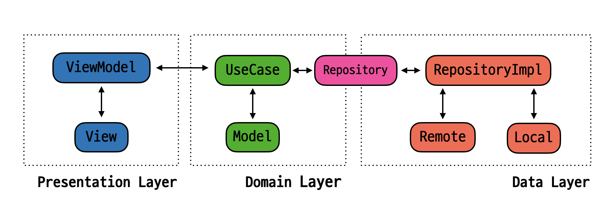
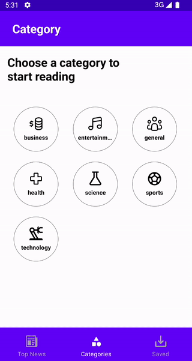
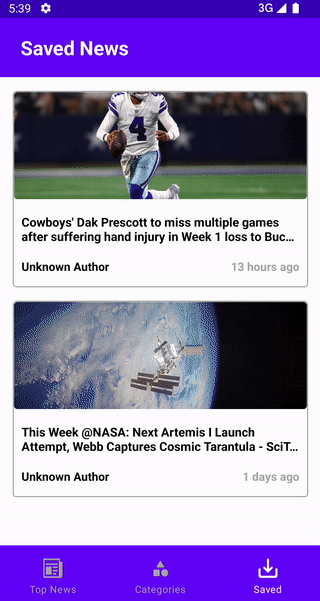

# wanted_preonboarding_android

**원티드 프리온보딩 사전 과제**입니다.

뉴스를 **조회 및 저장**할 수 있는 애플리케이션입니다.

# Architecture

<p align="center">

</p>

전체 아키텍처로 **`Clean Architecture`** 를 적용하였고, 각 레이어를 나눠 **`Multi Module`** 로 구성하였습니다.

특이사항으로 프로젝트의 규모가 크지 않다는 것을 고려하여 `Clean Architecture` 에서 **주로 사용하는 `DataSource` 영역을 제외**하였습니다.

**`Presentation` 모듈**에는 개별적으로 **`MVVM` 디자인 패턴을 적용**하였습니다.

# Package Structure

```
├── app
├── data
│     ├── di
│     ├── local
│     │    ├── dao
│     │    ├── entity
│     ├── remote
│     │    ├── api
│     │    ├── interactor
│     │    └── response
│     ├── repository
│     └── util
├── domain
│     ├── interactor
│     ├── model
│     ├── repository
│     └── usecase
├── presentation
│     ├── ui
│     │    ├── adapter
│     │    ├── category
│     │    ├── categoryNews
│     │    ├── detail
│     │    ├── main
│     │    ├── model
│     │    ├── news
│     │    ├── save
│     │    └── util
```

# Implementation

<p align="center">


</p>

- 해당 프로젝트는 **`Single Activity`** 의 형태로 구현되었습니다.
- [제공된 디자인 가이드](https://www.figma.com/file/oRIL54Wfi4CXD93WwXMbHN/%EC%9B%90%ED%8B%B0%EB%93%9C-%ED%94%84%EB%A6%AC%EC%98%A8%EB%B3%B4%EB%94%A9-%EC%95%88%EB%93%9C%EB%A1%9C%EC%9D%B4%EB%93%9C-%EC%82%AC%EC%A0%84%EA%B3%BC%EC%A0%9C?node-id=611%3A2)와 최대한 유사하게 구현하였습니다.
- 하단에 각 탭으로 진입할 수 있는 바텀 네비게이션이 있으며, 최신 뉴스와 카테고리별 뉴스, 저장한 뉴스를 조회할 수 있는 탭으로 구성되었습니다.
- 이미지를 불러올 수 없는 경우 준비된 이미지를 통해 유저에게 안내합니다. **(공통)**
- **모든 화면에 가로 모드 적용이 가능**합니다.

## Top News

<p align="center">
 >
</p>

- **최신 뉴스를 조회**할 수 있습니다.
- **뉴스 게재 후 경과 시간을 화면에 표현**합니다.
- 뉴스를 클릭하면 상세 정보를 확인할 수 있고, 별 모양 아이콘을 통해 내부 데이터베이스에 저장 및 삭제할 수 있습니다.
   - 만약 내부 데이터베이스에 이미 저장된 뉴스라면 우측 상단의 별 아이콘에 노란 배경이 추가됩니다.
- **화면을 위로 당겨 뉴스 새로고침이 가능**합니다.

## Category

<p align="center">
 >
</p>

- **카테고리별 뉴스를 조회**할 수 있습니다.
- **상단 앱바에 선택한 카테고리명이 출력**됩니다.
- 카테고리 선택 외에는 전체적으로 `Top News` 탭과 동일하게 동작합니다.

## Save

<p align="center">
 >
</p>

- **내부 데이터베이스에 저장된 뉴스를 조회**할 수 있습니다.
- 별 모양의 버튼을 클릭하여 내부 데이터베이스에 해당 뉴스를 추가 및 삭제할 수 있고, 이는 화면에도 바로 표현됩니다.
- **저장된 뉴스가 없을 경우 유저에게 안내 메시지를 출력**합니다.
- **엡 종료 후 재실행하여도 해당 뉴스 데이터는 유지됩니다.**

## Error Handling

<p align="center">
 >
</p>

- **네트워크 통신 중 에러가 발생하면 유저에게 안내**합니다.
- 유저는 **재시도 버튼을 클릭하여 다시 네트워크 통신을 시도**할 수 있습니다.
- 에러 핸들링 시 지원하는 에러 타입은 아래와 같습니다.
  - 타임아웃 에러
  - 서버 에러
  - 잘못된 요청
  - 원인 불명

## Multiple Backstack

<p align="center">
 >
</p>

- 탭별 백스택을 지원합니다.
- 다른 탭으로 이동해도 백스택이 초기화되지 않습니다.

# Tech Stack

**`Clean Architecture`**, **`MVVM`**, **`Multi Module`**, `Kotlin`, `Navigation`, `Hilt`, `Okhttp3`, `Retrofit2`, `Room`, `Glide`, `Databinding`, `BindingAdapter`, `ListAdapter`, `LiveData`, `SwipeRefreshLayout`

# Environment

- Android Studio Chipmunk | 2021.2.1
- minSdkVersion 21
- targetSdkVersion 32
- Test Device | Galaxy Note 8
